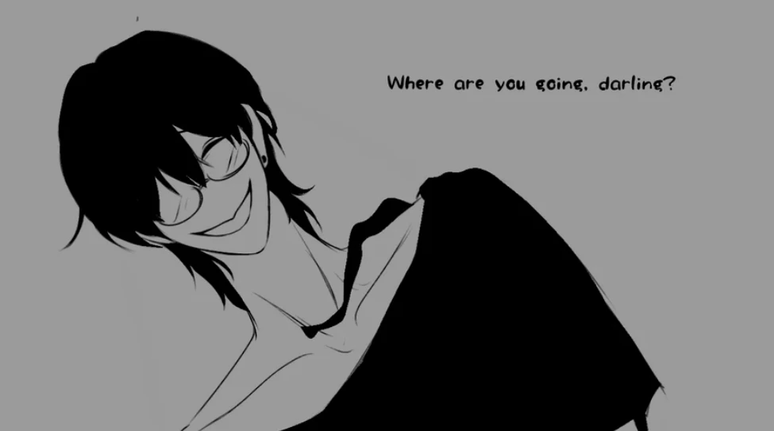
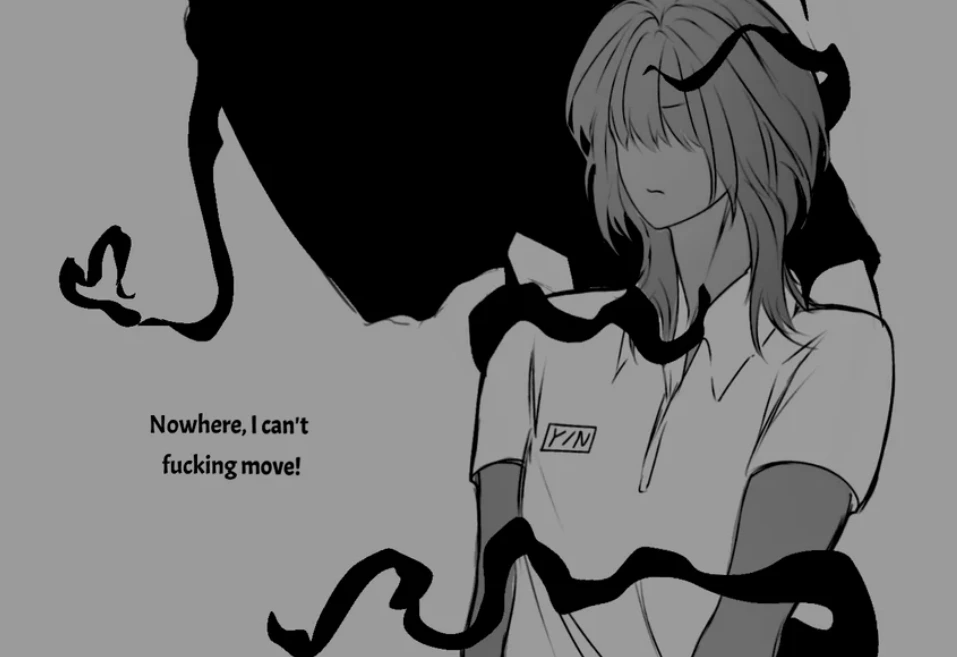
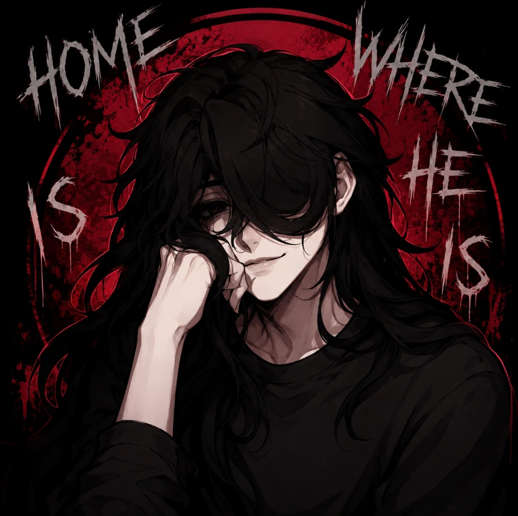

# SURVIVE MIN Psychological Horror Visual Novel

SURVIVE MIN is a browser horror visual novel built around proximity, dialogue, and the uneasy feeling that every answer is being measured. Instead of relying on constant action or loud jump scares, the game narrows its focus to Min, the player, and a conversation where affection can become pressure without warning. The website makes the game easy to launch online and supports it with original route analysis, screenshots, browser troubleshooting, character discussion, related horror games, and a detailed FAQ.

## Play SURVIVE MIN Online

- **Official website:** [https://survive-min.com/](https://survive-min.com/)
- **Launch the game:** <a href="https://survive-min.com/" target="_blank" rel="noopener">Play SURVIVE MIN online</a>
- **Style:** Psychological horror, visual novel choices, unsettling romance, browser play, routes, and endings

The live website is the recommended destination. This repository contains the generated static export used by the deployment platform. The public site provides the intended dark interface, fullscreen game player, shared game cards, Play More navigation, screenshots, videos, long-form introduction, and FAQ content.

## Horror Built From Attention

SURVIVE MIN works because attention becomes threatening. Min does not need to chase the player through a maze. She can create pressure by remembering an earlier response, watching too closely, asking for reassurance, or making an ordinary answer feel like a permanent commitment. The visual novel format keeps the danger close to the text box and character portrait. Small changes in expression or tone carry the weight that a larger horror game might assign to a monster reveal.

Players are encouraged to read slowly and consider what each response communicates beyond its literal wording. A kind answer may build trust, but it may also surrender distance. Resistance can protect a boundary while provoking a sharper reaction. Humor can reduce tension or signal willingness to continue a dangerous emotional game. These ambiguities give routes their replay value because the same line can feel romantic, manipulative, or frightening after the player has seen another ending.

## Screenshots and Route Atmosphere

The site places screenshots inside relevant sections rather than treating them as decoration at the bottom of the page. Images show the visual novel interface, character framing, dark backgrounds, and moments where a quiet conversation begins to feel unsafe. Descriptive alt text explains each image naturally for accessibility and search discovery. Stable local image paths keep the static export easy to cache and prevent core artwork from depending on remote dynamic URLs.

Route guidance remains spoiler-conscious. The introduction explains how to observe emotional turning points and compare consistent patterns without publishing a complete answer list. Players can record which choices made Min warmer, colder, more dependent, or more suspicious, then alter one pattern during the next run. This creates a useful method for exploring endings while preserving the experience of discovering what each branch means.

## A Growing Horror Collection

The website also hosts related browser games with different kinds of pressure. Some stories use domestic spaces, suspicious messages, public game shows, circus performers, or security systems. Others introduce movement and survival mechanics. Shared cards beneath every game frame keep the catalog connected, while each inner page preserves the artwork, content, videos, and writing appropriate to its own game.

The top Play More menu is maintained separately from external footer links. Internal game routes open in the current tab, while selected Dofollow external links point visitors toward related official sites. This distinction keeps navigation predictable and avoids accidentally changing the site's existing external-link strategy when a new game page is added.

## Home Is Where He Is

Home Is Where He Is extends the collection into domestic horror. It asks what happens when the idea of home becomes tied to a person whose protection may also be control. The page uses the same SURVIVE MIN shell while introducing its own warm-but-uneasy colors, screenshots, videos, and original discussion of safety, attachment, and boundaries. Its inclusion demonstrates how a shared layout can remain consistent without forcing every game into one writing style.

## Jackpot Crash Course

Jackpot Crash Course moves the pressure under casino lights. Eddie competes in a televised death game where a possible pardon is treated as a jackpot and contestant reactions become entertainment. The page includes browser play, two videos, screenshots, route strategy, mature-content notes, and a long original guide. Its card appears on the homepage, every existing game page, and its own page in the same compact card collection.

## Browser Help and Player Comfort

Desktop fullscreen offers the clearest text and character art, but mobile visitors can often play by rotating to landscape and giving the iframe focus. If a game remains black, the site recommends waiting for assets, refreshing once, and checking script blockers, privacy extensions, autoplay settings, and network restrictions. Browser saves may use local storage, so clearing site data or changing devices can remove progress.

Mature-content notes are included when games feature coercion, obsessive affection, violence, blood, disturbing imagery, or other intense themes. Horror is most effective when the player chooses the discomfort, so the site provides enough context to make an informed decision before pressing Play.

## Static Deployment

This repository is generated through the Next.js static export workflow. `npm run build-preserve-git` protects `out/.git`, runs the production build, restores the deployment repository, ensures the `main` branch and GitHub origin are configured, and copies this README template into `out/`. Direct edits to generated files may be lost during the next build; source changes belong in the main application. For the latest game pages and complete experience, visit [survive-min.com](https://survive-min.com/).
